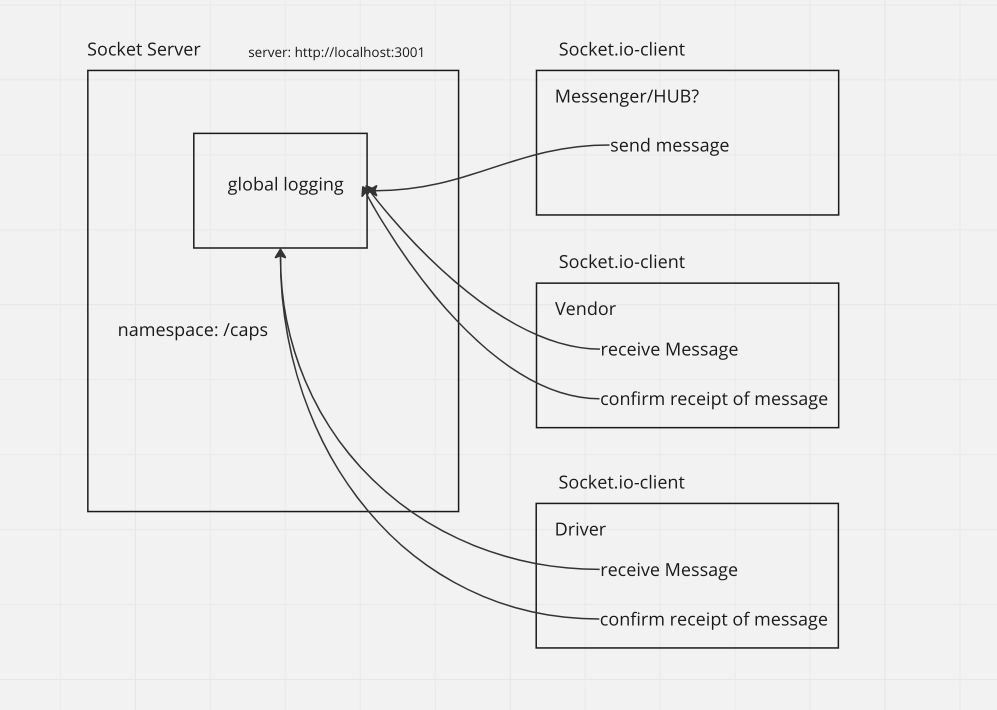
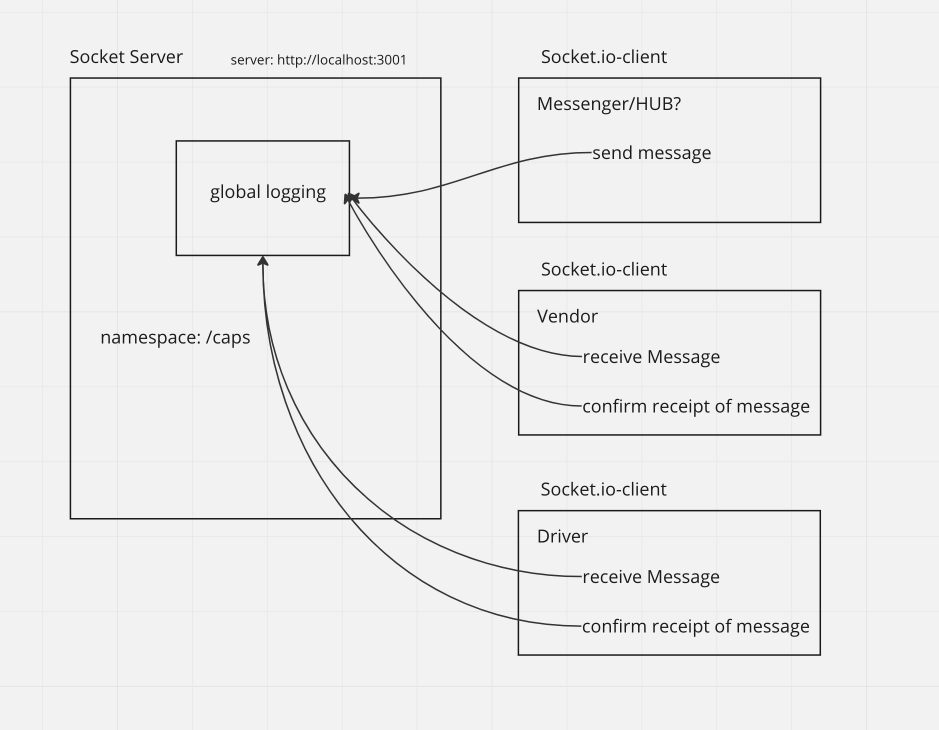
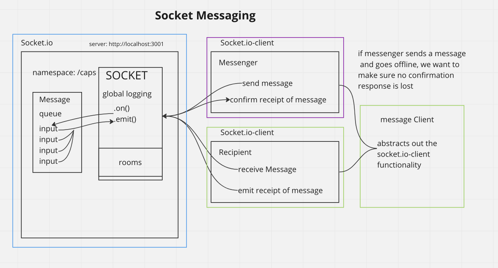

# CAPS

System that emulates a real world supply chain

## Phase 3 Requirements

### The following user/developer stories detail the major functionality for this phase of the project

* As a vendor, I want to alert the system when I have a package to be picked up.

* As a driver, I want to be notified when there is a package to be delivered.

* As a driver, I want to alert the system when I have picked up a package and it
  is in transit.

* As a driver, I want to alert the system when a package has been delivered.

* As a vendor, I want to be notified when my package has been delivered.

### As developers, here are some of the development stories that are relevant to the above

##### Phase 1

* As a developer, I want to use industry standards for managing the state of each
  package.

* As a developer, I want to create an event driven system so that I can write code that happens in response to events, in real time.

##### Phase 2

As a developer, I want to create network event driven system using Socket.io so that I can write code that responds to events originating from both servers and client applications

### UML

### Socket UML

### Queue UML

### Socket Messaging

